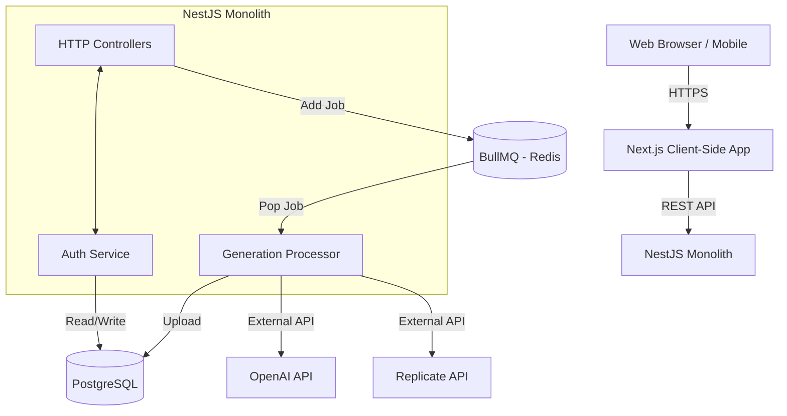

# 🗺️ REFACTOR ROADMAP — Arrena Photo (Часть 1/3)

**Уровень:** Staff Engineer / Tech Lead
**Статус:** В разработке (Часть 1 из 3)

---

## 📑 Оглавление (Полное)

1. **Executive Summary** _(В этой части)_
2. **Current State Analysis (AS-IS)** _(В этой части)_
3. **Target State Architecture (TO-BE)** _(В этой части)_
4. **Фаза 1: Zero-Trust Security (Days 1-5)** _(В этой части)_
5. **Фаза 2: Worker Extraction & Message Broker (Days 6-12)** _(В этой части)_
6. _Фаза 3: Database & Storage Migration (Ожидается)_
7. _Фаза 4: Strict Type Safety & API Contracts (Ожидается)_
8. _Фаза 5: Frontend Architecture, SSR & SEO (Ожидается)_
9. _Фаза 6: QA & Testing Automation (Ожидается)_
10. _Фаза 7: DevOps, Observability & Scaling (Ожидается)_
11. _Управление рисками (Risk Register) (Ожидается)_

---

## 1. Executive Summary

### 1.1 Бизнес-контекст и Технический Долг

Проект **Arrena Photo** находится на стадии уверенного MVP. Реализован богатый функционал: генерация изображений через несколько провайдеров (OpenAI, Replicate), внутренний маркетплейс шаблонов, биллинговая система с кредитами, многоязычность и кастомные UI-темы.

Однако внутренний аудит выявил, что архитектура системы не готова к масштабированию и содержит **критические уязвимости безопасности (Уровень P0)**, которые могут привести к полному захвату системы в первый же день публичного релиза.

**Главные проблемы:**

1. Открытые административные маршруты и жестко зашитые пароли.
2. Архитектурный антипаттерн хранения медиа-файлов (Base64) непосредственно в PostgreSQL.
3. Монолитная структура бэкенда, не позволяющая независимо масштабировать вычислительно сложные задачи (воркеры генерации) и легковесные HTTP-запросы.
4. Полное отсутствие автоматизированного тестирования.

### 1.2 Цели Рефакторинга

- **Безопасность (Security):** Внедрение концепции Zero-Trust. Полное закрытие всех несанкционированных доступов.
- **Отказоустойчивость (Reliability):** Гарантия того, что падение провайдера генерации не положит основной API-сервер.
- **Масштабируемость (Scalability):** Подготовка системы к нагрузке в 100k - 1M активных пользователей (DAU). Перенос тяжелых блобов из БД в S3.
- **Инженерная культура (Maintainability):** Внедрение строгой типизации TypeScript (отказ от `any`) и покрытия тестами.

---

## 2. Current State Analysis (AS-IS)

В текущей архитектуре система состоит из двух активных компонентов: Next.js фронтенд и NestJS бэкенд. База данных PostgreSQL используется как универсальное хранилище для всего: метаданных, сессий, токенов в открытом виде и сгенерированных изображений.

### 2.1 Топология AS-IS



### 2.2 Ключевые узкие места (Bottlenecks)

1. **Блокировка Event Loop:** В `GenerationProcessor` реализована искусственная задержка для бесплатных пользователей (`await new Promise(r => setTimeout(r, 30000))`). В NodeJS это удерживает воркер в активном состоянии 30 секунд, не позволяя ему брать другие задачи из очереди. Если придет 10 бесплатных запросов, пул воркеров будет исчерпан на полминуты.
2. **PostgreSQL Blob Storage:** Код `finalImageUrl = data:image/jpeg;base64,${base64String}` сохраняет миллионы символов в колонку таблицы `Generation`. Это приведет к катастрофической фрагментации таблиц, замедлению VACUUM и деградации скорости всех SELECT-запросов.
3. **Единая точка отказа:** Если `GenerationProcessor` падает из-за Out-Of-Memory (OOM) при обработке тяжелой картинки, падает весь контейнер `backend-api`, обрывая сессии всех пользователей.

---

## 3. Target State Architecture (TO-BE)

Целевая архитектура предполагает разделение на микросервисы (по паттерну Event-Driven Architecture) и использование специализированных хранилищ для разных типов данных.

### 3.1 Топология TO-BE

```mermaid
graph TD
    Client[Web Browser / Mobile] --> |HTTPS| CDN[Cloudflare / CDN]
    CDN --> |SSR / Static| Frontend[Next.js App Router]
    Client --> |REST API| Gateway[Nginx API Gateway]

    Gateway --> BackendAPI[NestJS Core API]

    subgraph Data Layer
        Postgres[(PostgreSQL 15 \n Relational Data)]
        RedisCache[(Redis Cache \n Rate Limits/Sessions)]
        S3[(MinIO / AWS S3 \n Object Storage)]
    end

    subgraph Message Broker
        BullMQ[(Redis BullMQ)]
    end

    subgraph Worker Nodes (Autoscalable)
        Worker1[Generation Worker 1]
        Worker2[Generation Worker 2]
    end

    BackendAPI --> |Write/Read Meta| Postgres
    BackendAPI --> |Cache requests| RedisCache
    BackendAPI --> |Push Job| BullMQ

    BullMQ --> |Pop Job| Worker1
    BullMQ --> |Pop Job| Worker2

    Worker1 --> |API Call| OpenAI
    Worker1 --> |API Call| Replicate
    Worker1 --> |Put Object| S3
    Worker1 --> |Update Status| Postgres
```

### 3.2 Преимущества TO-BE архитектуры

- **Горизонтальное масштабирование:** Мы можем поднять 10 инстансов WorkerNode во время маркетинговых кампаний, не трогая BackendAPI.
- **Оптимизация расходов:** БД PostgreSQL может оставаться на дешевом тарифе (хранит только текст), а дешевое S3-хранилище берет на себя терабайты изображений.
- **Отзывчивость:** Backend API отвечает за миллисекунды, так как только валидирует запрос и кладет его в BullMQ.

---

## 4. Фаза 1: Zero-Trust Security (Days 1-5)

Безопасность — наивысший приоритет. В текущем состоянии систему нельзя выпускать даже в закрытую бету.

### 4.1 Изоляция Административного Доступа

**Проблема (AS-IS):**
Эндпоинт `GET /auth/setup-admin` в `auth.controller.ts` позволяет любому пользователю сбросить или создать администратора. Пароль `admin123` захардкожен в `auth.service.ts`.
Контроллер `admin.controller.ts` защищен только `JwtAuthGuard`, что означает, что любой авторизованный юзер имеет доступ ко всем методам.

**Решение (TO-BE):**

1. **Удаление эндпоинта:** Полностью удалить `setup-admin` из контроллера и сервиса.
2. **Создание Seeder'а:** Написать скрипт `prisma/seed.ts`. Он должен читать переменные окружения `SUPERADMIN_EMAIL` и `SUPERADMIN_PASSWORD`, хэшировать пароль через bcrypt (минимум 10 rounds) и создавать запись в БД при деплое (или вручную через `pnpm prisma db seed`).
3. **Внедрение RolesGuard:**
   Создать строгий Guard, проверяющий поле `role` в JWT payload.

```typescript
// TO-BE Пример RolesGuard
import {
  Injectable,
  CanActivate,
  ExecutionContext,
  ForbiddenException,
} from "@nestjs/common";
import { Reflector } from "@nestjs/core";
import { RoleName } from "@prisma/client";
import { ROLES_KEY } from "../decorators/roles.decorator";

@Injectable()
export class RolesGuard implements CanActivate {
  constructor(private reflector: Reflector) {}

  canActivate(context: ExecutionContext): boolean {
    const requiredRoles = this.reflector.getAllAndOverride<RoleName[]>(
      ROLES_KEY,
      [context.getHandler(), context.getClass()],
    );
    if (!requiredRoles) return true;

    const request = context.switchToHttp().getRequest();
    const user = request.user;

    if (!user || !requiredRoles.includes(user.role)) {
      throw new ForbiddenException("Insufficient permissions");
    }
    return true;
  }
}
```

4. **Применение Guard'ов:** Повесить `@UseGuards(JwtAuthGuard, RolesGuard)` и `@Roles(RoleName.ADMIN)` глобально на весь `AdminController`.

### 4.2 Усиление JWT и Управление Секретами

**Проблема (AS-IS):**
В `auth.module.ts` используется статический fallback секрет: `config.get('JWT_SECRET', 'super-secret-key-change-me-in-production')`. Если девопс забудет прописать ENV, система будет работать со скомпрометированным ключом.

**Решение (TO-BE):**

1. Убрать fallback.
2. В `main.ts` добавить строгую валидацию ENV при старте через библиотеку `joi` или `zod`. Если `JWT_SECRET` нет или он короче 32 символов — делать `process.exit(1)` с ошибкой.
3. Шифрование OAuth-токенов в БД. Колонки `accessToken` и `refreshToken` в Prisma модели `User` сейчас хранятся в plain-text. Необходимо пропускать их через `EncryptionUtil` перед записью и при чтении.

### 4.3 Безопасность OAuth Flow

**Проблема (AS-IS):**
В `auth.controller.ts` метод `googleAuthCallback` делает редирект: `res.redirect(.../login?token=${access_token})`. Токен светится в URL (сохраняется в history браузера, логах провайдеров, логах балансировщиков).

**Решение (TO-BE):**
Использовать паттерн HTTP-Only Cookies или механизм Authorization Code Exchange.

- Вариант А: Бэкенд устанавливает JWT токен в `Set-Cookie: HttpOnly; Secure; SameSite=Strict` и делает редирект без параметров. Фронтенд больше не хранит токен в `localStorage`.
- Вариант Б: Бэкенд генерирует короткоживущий `auth_code`, делает редирект `?code=XYZ`. Фронтенд тут же делает POST-запрос с этим кодом и получает токен в JSON-теле.

---

## 5. Фаза 2: Worker Extraction & Message Broker (Days 6-12)

Разделение монолита критично для стабильности. Воркеры генерации потребляют много CPU/RAM при наложении водяных знаков и парсинге изображений.

### 5.1 Инициализация пакета Worker

**Шаги реализации:**

1. Использовать Nest CLI для создания второго приложения в monorepo: `nest generate app worker`.
2. Переместить файлы `generation.processor.ts`, `watermark.service.ts`, провайдеров (`openai-image.provider.ts`, `replicate-image.provider.ts`) в `apps/worker/src/`.
3. Настроить `apps/worker/src/main.ts` как Microservice.

```typescript
// TO-BE: apps/worker/src/main.ts
import { NestFactory } from "@nestjs/core";
import { WorkerModule } from "./worker.module";

async function bootstrap() {
  const app = await NestFactory.createApplicationContext(WorkerModule);
  // Инициализация логгера, подключение к Redis.
  // Само наличие BullMQ Worker внутри WorkerModule заставит процесс висеть и слушать очередь.
  console.log("Worker is listening for BullMQ jobs...");
}
bootstrap();
```

### 5.2 Рефакторинг Очередей (BullMQ)

В `apps/backend-api` останется только Producer (отправитель задач).
Нужно настроить общую библиотеку (или пакет) с интерфейсами задач (Job Payloads).

**Умные задержки (Smart Delays):**
Избавляемся от блокирующего `setTimeout`.
В `backend-api/generations.service.ts`:

```typescript
// TO-BE
const delayMs = user.planId === 'free' ? 30000 : 0;

await this.generationQueue.add(
  'process-generation',
  { generationId: generation.id, prompt, ... },
  {
    delay: delayMs, // Задача появится в очереди у Воркера только через 30 секунд
    removeOnComplete: true,
    attempts: 3,
    backoff: { type: 'exponential', delay: 5000 }
  }
);
```

Благодаря этому Воркер будет моментально обрабатывать задачи Premium-юзеров, а задачи Free-юзеров будут просто "висеть" в Redis до истечения 30 секунд, не занимая потоки Воркера.

### 5.3 Изоляция Зависимостей

- Убедиться, что `worker` имеет свой собственный `Dockerfile.worker`.
- В `docker-compose.prod.yml` разделить сервисы:
  - `backend` (port 4000)
  - `worker` (no exposed ports, only connects to Redis and Postgres)
- Добавить Healthchecks для воркера (отдельный легковесный HTTP-сервер на порту 3001, отвечающий на `/health`).

# 🗺️ REFACTOR ROADMAP — Arrena Photo (Часть 2/6)

**Уровень:** Staff Engineer / Chief Architect
**Статус:** Утвержден к исполнению (Часть 2 из 6)

---

## 5. Фаза 3: Database & Storage Migration (Days 13-20)

### 5.1 Проблематика текущего состояния (PostgreSQL TOAST Fragmentation)

В текущей реализации сгенерированные изображения (вотермарки) кодируются в формат `Base64` и сохраняются в колонку `resultImage` (тип `String`) таблицы `Generation` в PostgreSQL.

**Инженерный анализ проблемы:**

1. **Объем данных:** Одно изображение 1024x1024 в JPEG весит около 500 KB. В формате Base64 оно увеличивается на 33% и занимает около 665 KB.
2. **PostgreSQL TOAST (The Oversized-Attribute Storage Technique):** По умолчанию PostgreSQL хранит строки размером до 2-4 KB в основной странице (page). Все, что больше, выносится в отдельные TOAST-таблицы. Когда мы пишем 665 KB, Postgres разбивает это на сотни TOAST-chunks.
3. **Write-Ahead Logging (WAL) Bloat:** При каждом обновлении записи генерируется гигантский объем WAL-логов. Это замедляет репликацию на Slave-узлы и увеличивает нагрузку на I/O диска до 100%.
4. **Ухудшение производительности:** Операции `VACUUM` (очистка мертвых строк) будут занимать часы. Запросы вида `SELECT * FROM Generation ORDER BY createdAt DESC LIMIT 50` для ленты `Feed` вытягивают в память NodeJS более 33 Мегабайт текста (50 \* 665 KB), вызывая катастрофический Garbage Collection Pause (GC Pause) в V8.

**Вердикт:** Архитектура не переживет даже 10,000 сгенерированных изображений. Необходима срочная миграция блобов в специализированное S3-совместимое хранилище (MinIO).

### 5.2 Целевая Архитектура Хранилища (MinIO / S3)

Мы разворачиваем локальный MinIO в docker-compose, а для продакшена (AWS S3, Cloudflare R2 или Managed MinIO) используем идентичный API.

**Конфигурация MinIO (docker-compose.prod.yml):**

```yaml
minio:
  image: minio/minio:RELEASE.2023-11-20T22-40-07Z
  container_name: ai-studio-minio
  command: server /data --console-address ":9001"
  environment:
    MINIO_ROOT_USER: ${MINIO_ROOT_USER}
    MINIO_ROOT_PASSWORD: ${MINIO_ROOT_PASSWORD}
    MINIO_BROWSER_REDIRECT_URL: https://minio-console.${DOMAIN}
  volumes:
    - minio_prod_data:/data
  ports:
    - "9000:9000"
    - "9001:9001"
  restart: unless-stopped
```

### 5.3 Стратегия Миграции (Zero Downtime Dual-Write)

Чтобы не останавливать продакшен-систему на время перегонки гигабайтов Base64-кода в S3, мы применим паттерн **Dual-Write + Read-Repair**.

#### Шаг 1: Изменение Prisma Schema

Добавляем новую колонку для S3 URL, не удаляя старую.

```prisma
// packages/database/prisma/schema.prisma

model Generation {
  id          String   @id @default(uuid())
  userId      String
  // ... другие поля ...

  // Текущая колонка с Base64
  resultImage String?  @db.Text

  // НОВАЯ КОЛОНКА (S3 Object URL)
  s3ImageUrl  String?  @db.VarChar(255)

  createdAt   DateTime @default(now())
  updatedAt   DateTime @updatedAt

  @@index([createdAt(sort: Desc)])
  @@index([userId, createdAt(sort: Desc)])
}
```

#### Шаг 2: Модификация Worker'a (Dual-Write)

Обновляем логику сохранения изображений в воркере:

```typescript
// apps/worker/src/processor/generation.processor.ts

const base64String = watermarkedBuffer.toString("base64");
const base64Url = `data:image/jpeg;base64,${base64String}`;

// НОВАЯ ЛОГИКА: Загрузка в S3
const objectKey = `generations/${userId}/${generationId}.jpg`;
const s3Url = await this.storageService.uploadBuffer(
  watermarkedBuffer,
  "image/jpeg",
  objectKey,
);

// DUAL-WRITE: Пишем и старый Base64, и новый s3Url
await this.prisma.generation.update({
  where: { id: generation.id },
  data: {
    status: "COMPLETED",
    resultImage: base64Url,
    s3ImageUrl: s3Url,
  },
});
```

#### Шаг 3: Модификация Backend API (Read-Prefer-S3)

В контроллерах (Feed, History) меняем маппинг. Если есть `s3ImageUrl`, используем его. Если нет — падаем назад на `resultImage`.

```typescript
// apps/backend-api/src/generations/generations.service.ts

private mapGenerationResult(gen: Generation) {
  return {
    id: gen.id,
    prompt: gen.prompt,
    // Приоритет S3 над Base64
    imageUrl: gen.s3ImageUrl || gen.resultImage || null,
    createdAt: gen.createdAt,
    // ...
  };
}
```

#### Шаг 4: Background Migration Script

Пишем скрипт, который будет работать в фоне, сканировать старые записи без `s3ImageUrl`, конвертировать Base64 обратно в Buffer и грузить в S3.

```typescript
// scripts/migrate-base64-to-s3.ts
import { PrismaClient } from "@prisma/client";
import { StorageService } from "../apps/backend-api/src/storage/storage.service";

const prisma = new PrismaClient();
const storage = new StorageService();

async function runMigration() {
  let processed = 0;
  const BATCH_SIZE = 100;

  while (true) {
    const generations = await prisma.generation.findMany({
      where: {
        resultImage: { startsWith: "data:image" },
        s3ImageUrl: null,
      },
      take: BATCH_SIZE,
    });

    if (generations.length === 0) break;

    for (const gen of generations) {
      try {
        // Парсинг Base64
        const base64Data = gen.resultImage.replace(
          /^data:image\/\w+;base64,/,
          "",
        );
        const buffer = Buffer.from(base64Data, "base64");

        // Загрузка в S3
        const objectKey = `generations/migrated/${gen.userId}/${gen.id}.jpg`;
        const s3Url = await storage.uploadBuffer(
          buffer,
          "image/jpeg",
          objectKey,
        );

        // Обновление записи
        await prisma.generation.update({
          where: { id: gen.id },
          data: { s3ImageUrl: s3Url },
        });

        processed++;
        console.log(`Migrated ${processed}: ${gen.id}`);
      } catch (e) {
        console.error(`Failed to migrate ${gen.id}:`, e);
      }
    }
  }
  console.log(`Migration complete. Processed ${processed} records.`);
}
```

#### Шаг 5: Очистка Базы Данных (Data Purge)

После успешной отработки скрипта и верификации, что фронтенд корректно грузит картинки из S3:

1. Выполняем SQL: `UPDATE "Generation" SET "resultImage" = NULL WHERE "s3ImageUrl" IS NOT NULL;`
2. Запускаем: `VACUUM FULL "Generation";` (ВНИМАНИЕ: Блокирует таблицу, выполнять в период минимальной нагрузки).
3. Удаляем колонку `resultImage` из схемы Prisma.

### 5.4 Матрица Рисков Миграции (Migration Risk Assessment)

| ID    | Риск                                   | Probability | Impact | Mitigation Strategy                                                                                                                               | Rollback Plan                                                                                     |
| ----- | -------------------------------------- | ----------- | ------ | ------------------------------------------------------------------------------------------------------------------------------------------------- | ------------------------------------------------------------------------------------------------- |
| RM-01 | Скрипт миграции упадет на битом Base64 | High        | Low    | Обернуть обработку каждой записи в `try/catch`. Записать ID проблемных генераций в отдельный лог-файл `migration_errors.log` для ручного разбора. | Не требуется. Скрипт идемпотентен.                                                                |
| RM-02 | Недостаток места на S3-узле            | Medium      | High   | Настроить алерты в Grafana при заполнении диска S3 > 75%.                                                                                         | Приостановить миграционный скрипт, расширить Elastic Block Store (EBS) волюм, возобновить скрипт. |
| RM-03 | Перегрузка CPU БД во время миграции    | Medium      | High   | Использовать `take: 100` с искусственным `sleep(500)` между батчами в скрипте миграции, чтобы не перегружать Postgres IOPS.                       | Убить процесс миграции (Ctrl+C).                                                                  |
| RM-04 | CORS ошибки на фронтенде               | Low         | High   | Настроить CORS Policy на бакете MinIO: разрешить `GET` запросы с домена `https://arrena.ai`.                                                      | Вернуть маппинг в контроллере на использование `resultImage` (Base64) вместо S3.                  |

### 5.5 Оптимизация схемы БД (Индексы и Constraints)

Помимо миграции блобов, фаза 3 включает жесткую оптимизацию структуры реляционных таблиц.

**AS-IS проблема:** Отсутствие Foreign Key ограничений `ON DELETE CASCADE` для связанных таблиц.
**TO-BE решение:**

```prisma
model Template {
  id            String    @id @default(uuid())
  // ...
  userId        String
  user          User      @relation(fields: [userId], references: [id], onDelete: Cascade)

  versions      TemplateVersion[] // Автоматическое удаление версий при удалении шаблона
  generations   Generation[]
}
```

**Оптимизация пагинации (Cursor-based):**
Запросы ленты (Feed) сейчас используют Offset-пагинацию (`skip`, `take`), что при миллионах записей приведет к падению производительности. В этой фазе закладывается переход на Cursor-based пагинацию:

```typescript
// backend-api/src/generations/generations.service.ts
async function getFeedCursor(cursorId?: string, take: number = 20) {
  return this.prisma.generation.findMany({
    take,
    skip: cursorId ? 1 : 0,
    cursor: cursorId ? { id: cursorId } : undefined,
    orderBy: { createdAt: "desc" },
  });
}
```

---

_Конец Части 2. Ожидает генерации Части 3 (Спецификация типизации, API Контракты и создание Shared-Types)._

# 🗺️ REFACTOR ROADMAP — Arrena Photo (Часть 3/6)

**Уровень:** Staff Engineer / Chief Architect
**Статус:** Утвержден к исполнению (Часть 3 из 6)

---

## 7. Фаза 4: Strict Type Safety & API Contracts (Days 21-27)

### 7.1 Проблематика текущего состояния (`any` driven development)

Во время аудита зафиксировано более 50 случаев использования типа `any` в критически важных узлах системы: контроллерах биллинга, генерации и аутентификации.

**Почему это неприемлемо для Scale-up проекта:**

1. **Отсутствие Data Validation:** Если фронтенд пришлет `{ "amount": "сто рублей" }` вместо числа, NestJS пропустит это внутрь бизнес-логики, что приведет к SQL-ошибке (HTTP 500) или `NaN` в базе данных.
2. **Рассинхронизация команд:** Frontend-разработчики вынуждены угадывать, какие поля вернет эндпоинт `/generations/feed`. Часто возникают ошибки вида `Cannot read properties of undefined (reading 'url')`.
3. **Рефакторинг вслепую:** Невозможно безопасно изменить поле в БД, так как TypeScript не покажет, где именно на фронтенде это поле используется.

### 7.2 Архитектура пакета `packages/shared-types`

В pnpm-monorepo мы создадим отдельный npm-пакет, который будет шариться между бэкендом и фронтендом.

**Структура папок:**

```
packages/
└── shared-types/
    ├── package.json
    ├── tsconfig.json
    ├── src/
    │   ├── index.ts
    │   ├── enums/
    │   │   └── role.enum.ts
    │   ├── requests/
    │   │   ├── auth.request.ts
    │   │   └── generation.request.ts
    │   └── responses/
    │       ├── user.response.ts
    │       └── generation.response.ts
```

**Пример контракта (Request & Response):**

```typescript
// packages/shared-types/src/requests/generation.request.ts
export interface CreateGenerationRequest {
  prompt: string;
  negativePrompt?: string;
  modelId: string;
  aspectRatio: "1:1" | "16:9" | "9:16";
  numOutputs?: number;
}

// packages/shared-types/src/responses/generation.response.ts
export interface GenerationResponse {
  id: string;
  status: "PENDING" | "PROCESSING" | "COMPLETED" | "FAILED";
  imageUrl: string | null;
  createdAt: string; // ISO 8601
  errorDetail?: string;
}
```

### 7.3 Внедрение Data Transfer Objects (DTO) на Бэкенде

Интерфейсы хороши для фронтенда, но на бэкенде нам нужна валидация в рантайме. Мы внедряем `class-validator`.

**Настройка глобального пайпа (main.ts):**

```typescript
// apps/backend-api/src/main.ts
app.useGlobalPipes(
  new ValidationPipe({
    whitelist: true, // Автоматически удалять поля, которых нет в DTO
    forbidNonWhitelisted: true, // Выкидывать 400 Bad Request, если прислали лишнее (защита от Mass Assignment)
    transform: true, // Автоматически кастовать строки в числа, если тип указан как Number
  }),
);
```

**Пример правильного DTO:**

```typescript
// apps/backend-api/src/generations/dto/create-generation.dto.ts
import {
  IsString,
  IsNotEmpty,
  IsOptional,
  IsIn,
  MaxLength,
} from "class-validator";
import { CreateGenerationRequest } from "@arrena-photo/shared-types";

export class CreateGenerationDto implements CreateGenerationRequest {
  @IsString()
  @IsNotEmpty()
  @MaxLength(1000)
  prompt: string;

  @IsString()
  @IsOptional()
  @MaxLength(1000)
  negativePrompt?: string;

  @IsString()
  @IsNotEmpty()
  modelId: string;

  @IsIn(["1:1", "16:9", "9:16"])
  aspectRatio: "1:1" | "16:9" | "9:16";
}
```

**Рефакторинг Контроллера (Zero `any`):**

```typescript
// apps/backend-api/src/generations/generations.controller.ts
@Post()
@UseGuards(JwtAuthGuard)
async create(
  @CurrentUser() user: JwtPayload,
  @Body() dto: CreateGenerationDto // Неявная валидация, выбросит 400, если payload неверный
): Promise<GenerationResponse> {
  return this.generationsService.create(user.id, dto);
}
```

### 7.4 Строгая типизация Frontend (Axios / Fetch)

На клиенте мы обязаны использовать дженерики для каждого сетевого запроса.

**Создание строгого API-клиента:**

```typescript
// apps/frontend/lib/api.ts
import axios from "axios";
import {
  CreateGenerationRequest,
  GenerationResponse,
} from "@arrena-photo/shared-types";

const api = axios.create({ baseURL: process.env.NEXT_PUBLIC_API_URL });

export const GenerationAPI = {
  create: async (
    data: CreateGenerationRequest,
  ): Promise<GenerationResponse> => {
    const response = await api.post<GenerationResponse>("/generations", data);
    return response.data;
  },

  getFeed: async (): Promise<GenerationResponse[]> => {
    const response = await api.get<GenerationResponse[]>("/generations/feed");
    return response.data;
  },
};
```

### 7.5 Автоматизация документации (Swagger / OpenAPI)

Для того чтобы `shared-types` всегда соответствовал реальности, мы внедряем `@nestjs/swagger`.

```typescript
// apps/backend-api/src/main.ts
const config = new DocumentBuilder()
  .setTitle("Arrena Photo API")
  .setDescription("Internal API for Arrena Photo Client")
  .setVersion("1.0")
  .addBearerAuth()
  .build();
const document = SwaggerModule.createDocument(app, config);
SwaggerModule.setup("api/docs", app, document);
```

Благодаря этому, любой разработчик (или AI) всегда видит точную схему запросов в UI Swagger, а также может генерировать Postman-коллекции в один клик.

### 7.6 Оценка рисков (Typing Risk Matrix)

| Риск                                                                   | Probability | Impact | Mitigation Strategy                                                                                                                                    |
| ---------------------------------------------------------------------- | ----------- | ------ | ------------------------------------------------------------------------------------------------------------------------------------------------------ |
| Слом сборки `tsc` из-за цикличных зависимостей (Circular Dependencies) | Medium      | High   | `shared-types` должен быть абсолютно "тупым" пакетом без зависимостей на `backend` или `frontend`. Использовать только базовые типы.                   |
| Фронтенд падает при изменении DTO                                      | High        | Medium | Использовать семантическое версионирование. Внедрение изменений делать через создание V2-эндпоинтов, если они ломают старые мобильные клиенты.         |
| Mass Assignment уязвимости                                             | Low         | High   | Глобальный `ValidationPipe` с флагом `whitelist: true` обрезает любые payload-хаки (например, если хакер пришлет `{"role": "ADMIN"}` при регистрации). |

---

_Конец Части 3. Ожидает генерации Части 4 (Фаза 5: Оптимизация Frontend, SSR, SEO-архитектура и декомпозиция React-компонентов)._

# 🗺️ REFACTOR ROADMAP — Arrena Photo (Часть 4/6)

**Уровень:** Staff Engineer / Frontend Architect
**Статус:** Утвержден к исполнению (Часть 4 из 6)

---

## 8. Фаза 5: Frontend Architecture, SSR & SEO (Days 28-35)

### 8.1 Проблематика текущего состояния (Frontend Monoliths)

Аудит показал, что фронтенд (Next.js) страдает от "болезни толстых компонентов" и чрезмерного использования Client-Side Rendering (CSR).

**Симптомы:**

1. **Файл `generate/page.tsx`:** Содержит ~700 строк кода. В нем смешана логика UI (кнопки, слайдеры), бизнес-логика (вызов API генерации, поллинг), работа с состоянием (Zustand) и локализация (i18n).
2. **Тотальный `'use client'`:** Директива `'use client'` бездумно вешается на корневые Layout-файлы. Это полностью убивает возможности Server Components, увеличивает размер JavaScript-бандла для клиента и ухудшает First Contentful Paint (FCP).
3. **Отсутствие SEO-базы:** Нет динамических мета-тегов, `sitemap.xml` и `robots.txt`. Страницы маркетплейса шаблонов абсолютно невидимы для ботов Google.

### 8.2 Декомпозиция гигантских компонентов (Component Driven Design)

Рефакторинг `app/generate/page.tsx` по паттерну **Smart/Dumb Components**.

**Архитектура директории:**

```
apps/frontend/app/generate/
├── page.tsx               // Smart Server Component (Проверка авторизации, загрузка лимитов)
└── components/
    ├── GenerationLayout.tsx      // Dumb Layout (Сетка CSS)
    ├── PromptSettingsCard.tsx    // Dumb UI (Ввод текста, выбор Aspect Ratio)
    ├── ProviderSelector.tsx      // Dumb UI (Выбор OpenAI / Replicate)
    ├── ResultViewer.tsx          // Dumb UI (Отображение готовой картинки / скелетона)
    └── useGeneration.ts          // Smart Hook (Логика отправки API и поллинга)
```

**Пример Smart Hook'а (`useGeneration.ts`):**

```typescript
export function useGeneration() {
  const [isGenerating, setIsGenerating] = useState(false);
  const [result, setResult] = useState<GenerationResponse | null>(null);

  const generate = async (params: CreateGenerationRequest) => {
    setIsGenerating(true);
    try {
      const response = await GenerationAPI.create(params);
      // Внедрение логики Long Polling или подписки на WebSocket
      await startPolling(response.id);
    } catch (e) {
      toast.error("Ошибка генерации");
    } finally {
      setIsGenerating(false);
    }
  };

  return { isGenerating, result, generate };
}
```

_Эффект:_ Страница рендера становится абсолютно чистой, состоящей из 4-5 импортов. Любой разработчик может понять логику за 10 секунд.

### 8.3 Максимизация Server Components (SSR) и SEO

Переход на App Router обязывает нас использовать серверный рендеринг там, где это дает прирост производительности и SEO.

**1. Страница Маркетплейса (SEO-Friendly):**

```typescript
// AS-IS (Client Side Fetching)
'use client'
function Marketplace() {
  const { data } = useSWR('/templates', fetcher);
  if (!data) return <Loading />;
  return <div>{data.map(t => <TemplateCard />)}</div>
}

// TO-BE (Server Component + Streaming)
import { Suspense } from 'react';

// Эта страница рендерится на сервере мгновенно
export default async function MarketplacePage() {
  return (
    <main>
      <h1>AI Templates Marketplace</h1>
      <Suspense fallback={<TemplateGridSkeleton />}>
        {/* Асинхронный компонент сам сходит в БД/API во время серверного рендеринга */}
        <TemplateGridFetcher />
      </Suspense>
    </main>
  );
}
```

**2. Динамические Meta-теги (OpenGraph):**

```typescript
// apps/frontend/app/marketplace/[slug]/page.tsx
import { Metadata } from "next";

export async function generateMetadata({ params }): Promise<Metadata> {
  const template = await fetchTemplateBySlug(params.slug);

  return {
    title: `${template.name} - Generate AI Art`,
    description: template.shortDescription,
    openGraph: {
      title: template.name,
      images: [template.previewS3Url], // Картинка расшаривания в Telegram/Twitter
      type: "website",
    },
    alternates: {
      canonical: `https://arrena.ai/marketplace/${params.slug}`,
    },
  };
}
```

**3. Внедрение JSON-LD Schema:**
Для каждой публичной генерации или шаблона мы добавляем разметку `SoftwareApplication` или `ImageObject`, чтобы Google отображал красивые Rich Snippets (с рейтингом и ценой).

### 8.4 Оптимизация состояния (Zustand Store)

Удаление мусора из Persist Storage (Local Storage).
**Проблема:** Токен, профиль юзера, массив истории генераций и конфиг UI сохраняются в один огромный `localStorage`. Это вызывает баги рассинхронизации в нескольких вкладках.

**Решение:**

1. Вынести токен авторизации в `Cookies` (через пакет `js-cookie`), чтобы Middleware в Next.js мог читать его на сервере и делать редиректы недопуска пользователей к `/generate` до загрузки React.
2. `useAuthStore` хранит только юзера в памяти (без persist), токен восстанавливается из Cookie при инициализации.
3. История генераций не хранится в Zustand. Она фечится через React Query / SWR с кэшем на 5 минут.

### 8.5 Доступность (a11y) и Производительность

1. **Next/Image:** Жесткое требование использовать `<Image src={...} placeholder="blur" />` вместо тегов ``. Next.js автоматически конвертирует картинки из S3 в формат WebP/AVIF и отдает клиенту с нужным разрешением.
2. **Анимации (Framer Motion):** Отключить тяжелые анимации для пользователей, у которых в ОС включена настройка "Reduce Motion" (`useReducedMotion`).
3. **Viewport Fix:** Удалить `user-scalable=no` из `<meta name="viewport">` — это считается нарушением WCAG (пользователи со слабым зрением должны иметь возможность делать зум на смартфонах).

### 8.6 Матрица рисков Frontend-рефакторинга

| ID    | Риск                                                  | Probability | Impact | Mitigation Strategy                                                                                                                               |
| ----- | ----------------------------------------------------- | ----------- | ------ | ------------------------------------------------------------------------------------------------------------------------------------------------- |
| FR-01 | Hydration Error (Несоответствие Server и Client HTML) | High        | Medium | Использовать хук `useMounted` перед рендерингом компонентов, зависящих от `window` (например, Theme Toggle).                                      |
| FR-02 | FOUC (Flash of Unstyled Content)                      | Medium      | High   | Гарантировать, что Tailwind-стили инжектятся сервером (в App Router это работает из коробки, если не использовать `'use client'` в `layout.tsx`). |
| FR-03 | Утечки памяти (Memory Leaks) в Long Polling           | High        | Medium | В `useGeneration.ts` строго вызывать `clearTimeout/clearInterval` в функции `useEffect` cleanup.                                                  |

---

_Конец Части 4. Ожидает генерации Части 5 (Фаза 6: QA Автоматизация, E2E тесты и CI/CD)._

# 🗺️ REFACTOR ROADMAP — Arrena Photo (Часть 5/6)

**Уровень:** Staff Engineer / QA Architect
**Статус:** Утвержден к исполнению (Часть 5 из 6)

---

## 9. Фаза 6: QA & Testing Automation (Days 36-45)

### 9.1 Проблематика текущего состояния (0% Test Coverage)

Во время аудита обнаружено, что в проекте полностью отсутствуют тесты (Unit, Integration, E2E).
Слияние любого PR (Pull Request) — это игра в рулетку. Рефакторинг (особенно переход на S3 и удаление `any`) немыслим без автоматизированной защиты (Safety Net).

Мы внедряем классическую Пирамиду Тестирования.

### 9.2 Unit Testing (Jest) — Уровень Бизнес-Логики

Фокус Unit-тестов: Сервисы биллинга, авторизации и водяных знаков.

**Пример архитектуры тестов для BillingService (Защита от двойных списаний):**
Мы не стучимся в реальную БД, а используем `jest-mock-extended` для мокирования PrismaClient.

```typescript
// apps/backend-api/src/billing/billing.service.spec.ts
import { Test, TestingModule } from "@nestjs/testing";
import { BillingService } from "./billing.service";
import { PrismaService } from "../prisma/prisma.service";
import { mockDeep, DeepMockProxy } from "jest-mock-extended";
import { PrismaClient } from "@prisma/client";

describe("BillingService", () => {
  let service: BillingService;
  let prismaMock: DeepMockProxy<PrismaClient>;

  beforeEach(async () => {
    prismaMock = mockDeep<PrismaClient>();
    const module: TestingModule = await Test.createTestingModule({
      providers: [
        BillingService,
        { provide: PrismaService, useValue: prismaMock },
      ],
    }).compile();

    service = module.get<BillingService>(BillingService);
  });

  it("должен списать 5 кредитов, если на балансе достаточно средств", async () => {
    // Настраиваем mock: $executeRaw возвращает 1 (строка успешно обновлена)
    prismaMock.$executeRaw.mockResolvedValueOnce(1);

    const result = await service.deductCredits("user-123", 5);

    expect(result).toBe(true);
    // Проверка, что атомарный SQL запрос был вызван
    expect(prismaMock.$executeRaw).toHaveBeenCalledWith(
      expect.stringContaining(
        'UPDATE "User" SET credits = credits - 5 WHERE id = $1 AND credits >= 5',
      ),
    );
  });

  it("должен выдать ошибку (возвратить false), если кредитов не хватает", async () => {
    // Настраиваем mock: $executeRaw возвращает 0 (ни одна строка не обновлена)
    prismaMock.$executeRaw.mockResolvedValueOnce(0);

    const result = await service.deductCredits("user-123", 100);
    expect(result).toBe(false);
  });
});
```

### 9.3 End-to-End Testing (Playwright) — Уровень Пользователя

Unit-тесты не поймают баг, если сломалась кнопка "Сгенерировать" на фронтенде или отвалился CORS. Нам нужны тесты реального браузера.

**Сценарий: "Critical Path" (Регистрация -> Оплата -> Генерация)**

```typescript
// tests/e2e/generation-flow.spec.ts
import { test, expect } from "@playwright/test";

test.describe("Основной флоу генерации изображения", () => {
  test("Авторизованный юзер может создать картинку и увидеть её в истории", async ({
    page,
  }) => {
    // 1. Авторизация (Мокирование API логина для скорости)
    await page.route("**/api/v1/auth/me", (route) => {
      route.fulfill({
        status: 200,
        body: JSON.stringify({
          id: "1",
          email: "test@arrena.ai",
          credits: 100,
        }),
      });
    });

    // 2. Переход на страницу генерации
    await page.goto("/generate");

    // 3. Заполнение формы
    await page.fill(
      'textarea[name="prompt"]',
      "Киберпанк город будущего, неон",
    );
    await page.selectOption('select[name="aspectRatio"]', "16:9");

    // 4. Перехват API запроса на генерацию (чтобы не тратить реальные деньги в OpenAI)
    await page.route("**/api/v1/generations", (route) => {
      route.fulfill({
        status: 201,
        body: JSON.stringify({
          id: "gen-123",
          status: "COMPLETED",
          imageUrl: "https://mock-s3.com/img.jpg",
        }),
      });
    });

    // 5. Клик и ожидание
    await page.click('button[type="submit"]');

    // 6. Проверка результата в UI
    const resultImage = page.locator('img[alt="Generation Result"]');
    await expect(resultImage).toBeVisible({ timeout: 5000 });
    await expect(resultImage).toHaveAttribute(
      "src",
      "https://mock-s3.com/img.jpg",
    );

    // Проверка снятия кредитов в шапке (100 -> 99)
    await expect(page.locator(".credits-badge")).toContainText("99");
  });
});
```

### 9.4 Интеграция CI/CD (GitHub Actions)

Ни один код не должен попадать в ветку `main` без прохождения пайплайна.

**Создание файла `.github/workflows/pr-check.yml`:**

```yaml
name: PR Safety Check
on:
  pull_request:
    branches: [main, develop]

jobs:
  lint-and-typecheck:
    runs-on: ubuntu-latest
    steps:
      - uses: actions/checkout@v4
      - uses: pnpm/action-setup@v2
        with:
          version: 8
      - uses: actions/setup-node@v4
        with:
          node-version: "20"
          cache: "pnpm"

      - name: Install dependencies
        run: pnpm install --frozen-lockfile

      - name: Check Formatting (Prettier)
        run: pnpm run format:check

      - name: Linting (ESLint)
        run: pnpm run lint

      - name: Type Check (tsc)
        run: pnpm run typecheck # Запускает tsc --noEmit во всех пакетах

  unit-tests:
    runs-on: ubuntu-latest
    needs: lint-and-typecheck
    steps:
      - uses: actions/checkout@v4
      - uses: pnpm/action-setup@v2
      - uses: actions/setup-node@v4
      - run: pnpm install --frozen-lockfile
      - name: Run Backend Tests
        run: pnpm --filter @arrena-photo/backend-api run test:cov
      - name: Upload Coverage
        uses: codecov/codecov-action@v3
```

### 9.5 Матрица Рисков QA-внедрения

| Риск                                        | Probability | Impact | Mitigation Strategy                                                                                                                       |
| ------------------------------------------- | ----------- | ------ | ----------------------------------------------------------------------------------------------------------------------------------------- |
| E2E тесты ложные срабатывания (Flaky Tests) | High        | Medium | Использовать жесткие моки для внешних провайдеров (Stripe, OpenAI) в Playwright. Внедрить авто-retries в конфиге `retries: 2`.            |
| Разработчики игнорируют покрытие тестами    | Medium      | Medium | Настроить в GitHub Actions проверку `coverage-threshold` (минимум 70%). PR не смержится, если покрытие упадет ниже лимита.                |
| Замедление CI/CD конвейера (> 15 минут)     | Medium      | Low    | Настроить кэширование `.next` папки и `node_modules`. Выделить E2E тесты в отдельный Job, который запускается параллельно с Unit-тестами. |

---

_Конец Части 5. Ожидает генерации Части 6 (Фаза 7: Инфраструктура, DevOps, Docker Multi-stage builds, Мониторинг Grafana/Sentry и Финальное Резюме)._

# 🗺️ REFACTOR ROADMAP — Arrena Photo (Часть 6/6)

**Уровень:** Staff Engineer / DevOps Architect
**Статус:** Утвержден к исполнению (Часть 6 из 6)

---

## 10. Фаза 7: DevOps, Observability & Scaling (Days 46-50)

### 10.1 Проблематика текущего состояния (DevOps & Infrastructure)

Текущая конфигурация развертывания (Render + `render.yaml`) и `docker-compose.prod.yml` не оптимизирована для микросервисной архитектуры.

- Образы собираются долго, содержат кучу лишних `devDependencies` и весят более 1.5 ГБ каждый.
- В корне репозитория разбросаны Python и Node.js скрипты одноразового использования, загрязняющие кодовую базу.
- Полностью отсутствует система мониторинга ошибок (Observability). Если у клиента падает генерация, мы узнаем об этом только из гневных писем в поддержку.

### 10.2 Очистка Репозитория (Repository Hygiene)

Перед релизом необходимо привести кодовую базу в идеальный порядок:

1. Переместить все `.js`, `.py` и `.ts` скрипты из корня в директорию `scripts/`.
2. Создать `scripts/README.md` с описанием назначения каждого скрипта (например, миграция БД, очистка кэша, генерация тестовых юзеров).
3. Удалить неиспользуемые зависимости из `package.json` на уровне монорепы.

### 10.3 Оптимизация Контейнеризации (Multi-Stage Dockerfiles)

Для снижения веса образов, ускорения деплоя и повышения безопасности (отсутствие компиляторов внутри продакшен-образа) мы переходим на **Multi-Stage Builds**.

**Пример TO-BE Dockerfile для Backend API:**

```dockerfile
# apps/backend-api/Dockerfile

# Stage 1: Build (Сборка)
FROM node:20-alpine AS builder
WORKDIR /app
# Устанавливаем pnpm
RUN corepack enable && corepack prepare pnpm@latest --activate
# Копируем конфиги
COPY package.json pnpm-lock.yaml pnpm-workspace.yaml ./
COPY apps/backend-api/package.json ./apps/backend-api/
COPY packages/ ./packages/
# Устанавливаем ВСЕ зависимости (включая dev)
RUN pnpm install --frozen-lockfile
# Копируем исходники и собираем
COPY apps/backend-api ./apps/backend-api
RUN pnpm run build --filter @arrena-photo/backend-api

# Stage 2: Production (Рантайм)
FROM node:20-alpine AS runner
WORKDIR /app
ENV NODE_ENV=production
RUN corepack enable && corepack prepare pnpm@latest --activate

# Копируем только продакшен зависимости
COPY package.json pnpm-lock.yaml pnpm-workspace.yaml ./
COPY apps/backend-api/package.json ./apps/backend-api/
COPY packages/ ./packages/
RUN pnpm install --prod --frozen-lockfile

# Копируем собранный код
COPY --from=builder /app/apps/backend-api/dist ./apps/backend-api/dist

USER node # Запускаем от непривилегированного пользователя (Security Requirement)
EXPOSE 4000
CMD ["node", "apps/backend-api/dist/main.js"]
```

_Эффект:_ Размер образа сократится с ~1.5 ГБ до ~150-200 МБ. Уменьшение поверхности атаки (Attack Surface).

### 10.4 Внедрение Observability (Sentry & Grafana)

Система должна быть "прозрачной" (Observable). Мы должны узнавать об ошибках раньше, чем пользователи.

**1. Интеграция Sentry (Error Tracking):**
На бэкенде подключаем Sentry через глобальный Exception Filter.

```typescript
// apps/backend-api/src/common/filters/sentry.filter.ts
import * as Sentry from "@sentry/node";
import { Catch, ArgumentsHost } from "@nestjs/common";
import { BaseExceptionFilter } from "@nestjs/core";

@Catch()
export class SentryFilter extends BaseExceptionFilter {
  catch(exception: unknown, host: ArgumentsHost) {
    Sentry.captureException(exception); // Отправляем ошибку в Sentry
    super.catch(exception, host); // Отдаем стандартный HTTP ответ юзеру
  }
}
```

На фронтенде (Next.js) настраиваем `@sentry/nextjs`, чтобы отлавливать JS-ошибки в браузере клиента (с привязкой к Source Maps для точного указания строки кода).

**2. Метрики (Prometheus & Grafana):**
Подключаем пакет `@willsoto/nestjs-prometheus` для экспорта метрик NestJS (CPU, Memory, Request Rate, HTTP 500 Count).
В Grafana создаем дашборды для мониторинга:

- Количества активных задач в BullMQ.
- Времени ответа API-провайдеров (OpenAI, Replicate).
- Потребления RAM воркерами.

### 10.5 Матрица Рисков DevOps (Infrastructure Risk Assessment)

| Риск                                 | Probability | Impact   | Mitigation Strategy                                                                                                                      |
| ------------------------------------ | ----------- | -------- | ---------------------------------------------------------------------------------------------------------------------------------------- |
| Out-Of-Memory (OOM) Killed Container | Medium      | High     | Настройка жестких лимитов RAM в Docker Compose (`deploy.resources.limits.memory`). Использование `maxOldSpaceSize` флагов для Node.js.   |
| Утечка .env секретов в Docker image  | Low         | Critical | Исключить файлы `.env` через `.dockerignore`. Передавать секреты только в рантайме через переменные окружения инфраструктуры.            |
| Сбой релиза (Bad Deployment)         | Low         | High     | Настроить Healthchecks в Docker. Контейнер не должен помечаться как `healthy`, пока БД и Redis недоступны. Использовать Rolling Updates. |

---

## 11. ЗАКЛЮЧЕНИЕ: Итоги Roadmap'а

Реализация этого 7-фазного Roadmap превратит Arrena Photo из MVP с "сырой" архитектурой в Enterprise-ready систему.

**Что мы получим на выходе:**

1. **Security:** Полностью защищенный RBAC периметр, зашифрованные секреты, отсутствие хардкода.
2. **Scalability:** Изолированный пул Воркеров (Worker Nodes), которые можно множить горизонтально при наплыве трафика. Дешевое объектное S3 хранилище вместо забитой Base64 базы PostgreSQL.
3. **Maintainability:** Полное покрытие строгими TypeScript контрактами (`shared-types`), нулевой `any` в бизнес-логике.
4. **Reliability:** Инфраструктура покрыта Unit и E2E тестами (Jest/Playwright).
5. **SEO & UX:** Серверный рендеринг (SSR), идеальная видимость для Google-ботов, мгновенная загрузка.

**Следующий логический шаг проекта:**
Трансляция этого высокоуровневого стратегического Roadmap'а в практический Бэклог Задач для разработчиков — создание документа **`TODO_REFACTOR.md`**, который разобьет эти 7 фаз на 100-200 конкретных, оцениваемых в часах тасок с приоритетами и зависимостями.

---

**[КОНЕЦ ДОКУМЕНТА REFACTOR_ROADMAP]**
