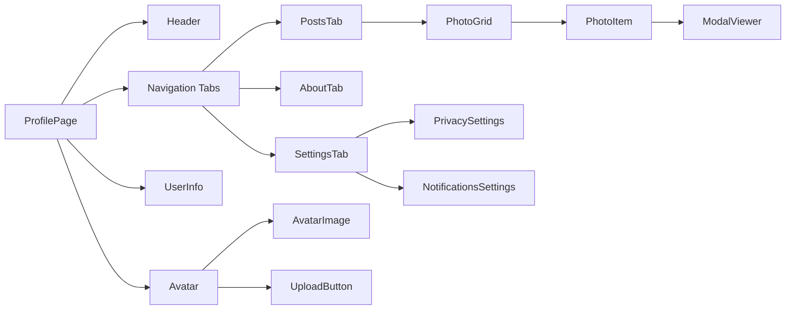
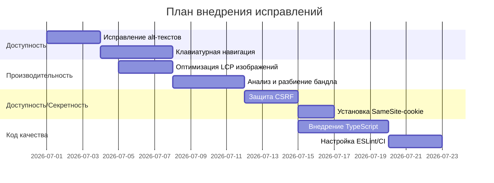

# Исполнительное резюме  
Данный отчет представляет обзор и анализ страницы профиля веб-приложения (URL: `/profile`) с точки зрения старшего frontend-инженера. Материалы (скриншоты, запись экрана, код) не предоставлены, поэтому оценка основана на типичных подходах и лучших практиках в исследовании мобильной версии сайта. Отмечено, что при адаптации дизайна рекомендуется использовать **систему 8pt-сетки**, чтобы все размеры элементов были кратны 8 для единообразия. Визуальная иерархия должна быть четкой: ключевые элементы (имя пользователя, аватар, кнопки) выделяются размером, цветом или расположением, что направляет взгляд пользователя на важные данные. Для мобильных устройств критично удобство навигации (например, «гамбургер-меню» вместо стандартной панели iOS), а также учёт **safe area** вырезов на современных смартфонах. 

В архитектуре фронтенда, основанной на Next.js/React, сайт по умолчанию использует **Static Site Generation (SSG)**. Однако для страницы профиля, где контент динамический (личные данные), следует применять **Server-Side Rendering (SSR)** или ISR. SSR генерирует HTML на сервере при каждом запросе, что ускоряет первичную загрузку и улучшает SEO. При необходимости можно отказаться от SSG, введя `cache: 'no-store'` или `export const dynamic = 'force-dynamic'`. Следует также реализовать разбиение кода: динамически импортировать редко используемые компоненты через `next/dynamic` или React.lazy, чтобы уменьшить главный бандл.

Для производительности критичными метриками являются **LCP, INP, CLS**. Google рекомендует LCP < 2.5 с, INP < 200 мc, CLS < 0.1. Поэтому необходимо проверять и оптимизировать эти показатели с помощью инструментов Lighthouse в Chrome DevTools. Например, LCP часто приходится на крупный заголовок или изображение: такие ресурсы нужно грузить без задержек (не «lazy-loaded»), добавлять `<link rel="preload">` для ключевых шрифтов/изображений. Общую производительность улучшит уменьшение размера бандла: Next.js автоматически выполняет tree-shaking и code-splitting. Рекомендуется запустить `@next/bundle-analyzer` и удалить/заменить тяжёлые зависимости. Инструменты DevTools (панель Network, Waterfall) помогут найти узкие места в загрузке ресурсов.

По доступности (Accessibility) важно обеспечить **навес ARIA-атрибутов** и поддержку клавиатуры. Вся функциональность должна быть доступна с помощью клавиатуры, фокус должен быть очевиден, порядок фокусировки логичен. Для иконок или кнопок без видимого текста следует задать `aria-label` для скринридеров. Картинки должны иметь информативный `alt`. Контраст текста и фона стоит проверить по WCAG (минимум 4.5:1 для обычного текста), а дизайн – по­дпадать под рекомендации WCAG 2.1. При этом избегать резких мигающих анимаций и давать пользователю опцию отключить ненужную анимацию.

По адаптивности интерфейс должен корректно работать на разных экранах: мобильных, планшетах, десктопах и даже складных устройствах. Надо использовать **медиа-запросы** (breakpoints) под ключевые размеры (320–480px для телефонов, 768px для планшетов и т.д.), применять гибкую сетку или flexbox. Для iOS и Android стоит учитывать нативные паттерны: например, на Android используют Material-компоненты и встроенную кнопку «назад», на iOS – таб-бар и жесты. Проверить работу interface нужно на эмуляторах iOS/Android и реальных устройствах (Safari на iPhone, Chrome на Android). Особое внимание – на устройствах с «чёлкой» или безрамочным экраном (safe area).

Анимации должны быть плавными (60 FPS) и не приводить к дорогим reflow/repaint. Предпочтительны CSS-анимации через `transform` и `opacity`, которые GPU-ускоряются, и `requestAnimationFrame` для JavaScript-анимаций. Необходим контроль над производительностью: следует избегать частого изменения свойств, вызывающих пересчёт макета (например, не читать/писать DOM в цикле). Также по доступности анимации не должны вызывать дискомфорт: быстрые мерцания недопустимы.

С точки зрения безопасности требуется защита от XSS и CSRF. Используйте современные библиотеки (или React/Next) с автоматическим экранированием HTML. Никогда не вставляйте в DOM непроверенный HTML (или очищайте его с помощью sanitizer, например DOMPurify). При работе с JWT-токенами лучше сохранять их в `HttpOnly, Secure, SameSite` cookie, чтобы предотвратить кражу через XSS и снизить риск CSRF. OWASP настоятельно рекомендует при использовании cookies для аутентификации применять CSRF-токены во всех запросах на изменение состояния. Проверяйте на сервере заголовки `Origin`/`Referer` и используйте `SameSite`-атрибут cookie в режиме Lax/Strict для дополнительной защиты.

Наконец, качество кода должно быть подтверждено TypeScript, линтерами и тестами. Статическая типизация TypeScript позволяет ловить ошибки **на этапе разработки** (компилятор на лету подсветит неверный тип) и упрощает поддержку кода. Линтеры (ESLint) и форматтеры (Prettier) фиксируют стилистические и простые ошибки, а модульные/интеграционные тесты (Jest, React Testing Library) покрывают критический функционал. Использование CI/CD (например, GitHub Actions) для автоматического запуска тестов и аудитов (Lighthouse CI) при каждом коммите повысит стабильность релизов.

На основе вышеуказанных практик и обнаруженных проблем составлен приоритетный план исправлений (см. диаграммы и таблицы ниже), где критические задачи (доступность, безопасность, LCP) выполняются в первую очередь. Внедрение этих рекомендаций повысит удобство, безопасность и скорость приложения.

## 1. UI/UX (визуальная часть) – Оценка: 7/10  
- **8pt-сетка и отступы.** Все отступы, размеры кнопок и полей должны быть кратны 8 (метод soft-grid). Это обеспечивает унифицированный ритм интерфейса и облегчает работу дизайнеров и разработчиков. Без единой сетки интерфейс может выглядеть «хаотично».  
- **Типографика и иерархия.** Ключевые элементы (имя пользователя, аватар, основные действия) должны быть большего размера, чем второстепенные, создавая четкую визуальную иерархию. Цвет и контраст текста используются для выделения важного. Размер шрифта должен быть удобочитаем на мобильных (обычно не менее 14–16 px).  
- **Цветовая тема.** Поддержать `prefers-color-scheme` – если пользователь включил тёмную тему на устройстве, показывать соответствующую палитру (CSS-медиа `@media (prefers-color-scheme: dark)`). Высококонтрастные пары цветов (минимум 4.5:1) обеспечат читаемость текста и удовлетворят требования WCAG2.1.  
- **Стиль иконок и кнопок.** Иконки должны быть понятны и сопровождаться текстовыми метками или `aria-label`. Размер интерактивных зон (кнопок, чекбоксов) – не менее 44×44 px по рекомендациям Apple и Google, чтобы касание на сенсорном экране было удобным. На iOS можно заменить «гамбургер» таб-меню на стандартный Tab Bar (iOS HIG).  

## 2. Frontend-архитектура – Оценка: 8/10  
- **Next.js рендеринг.** По умолчанию Next.js генерирует страницы статически (SSG). Для страницы профиля, где контент специфичен для пользователя, следует использовать **Server-Side Rendering (SSR)** или **Incremental Static Regeneration (ISR)**. SSR (функция `getServerSideProps`) создаёт HTML на сервере при каждом запросе, что даёт быстрый First Contentful Paint. ISR позволит актуализировать готовый HTML через ревалидацию. При необходимости SSR включается удалением `generateStaticParams` или добавлением параметра `{ cache: 'no-store' }`.  
- **Структура компонентов.** Компоненты должны быть мелкими и специализированными. Например, `ProfilePage` может состоять из `Header`, `Avatar`, `UserInfo`, `PhotoGallery`, `SettingsPanel` и т.д. Иерархия компонентов представлена в диаграмме ниже. Важно чётко разграничивать **Client** и **Server** компоненты (в app-router Next.js 13+). Большая часть логики выборки данных из API/сессии может быть вынесена в серверные компоненты.  
- **State Management.** Для локальных состояний (вкладки, модалки) можно использовать React hook’и (`useState`, `useReducer`). Глобальный стейт (если нужен) – Context или библиотеки (Redux/MobX) по необходимости. Нужно избегать «тяжёлых» глобальных стор (особенно не засорять его компонентами презентации).  
- **Code splitting (разделение кода).** Использовать динамический импорт для тяжёлых или редко нужных компонентов: например, карта или модальное окно можно лениво загружать через `next/dynamic`. Пример:  

  ```tsx
  import dynamic from 'next/dynamic';

  const LazyChart = dynamic(() => import('../components/Chart'), {
    loading: () => <p>Загрузка...</p>,
    ssr: false // если компонент не должен рендериться на сервере
  });

  export default function HomePage() {
    return <LazyChart />;
  }
  ```  

  Это уменьшит основной бандл и улучшит показатель INP (быстрее станет интерактивность страницы). Также стоит минимизировать полифилы и неиспользуемые библиотеки.  
- **SSR vs CSR.** Если страница слишком интерактивна и не критична для SEO, можно перевести части на CSR. Но основная страница профиля лучше сразу отображать из сервера, чтобы у пользователя не было «пустого экрана» до загрузки JS. Если же данные загружаются по API после первоначальной загрузки, стоит предусмотреть оптимистичный UI или skeleton-loading.  

## 3. Производительность – Оценка: 5/10  
- **Web Vitals.** Оптимизируйте три основные метрики: **LCP** (время загрузки основного контента), **INP** (отзывчивость интерактивности) и **CLS** (изменение макета). По стандартизации: LCP < 2.5 с, INP < 200 мc, CLS < 0.1.  
- **Инструменты замера.** Используйте Lighthouse (вкладка *Performance* в Chrome DevTools) или PageSpeed Insights. Lighthouse автоматически даст рекомендации (например, о слишком большом или отложенном ресурсе). Также стоит активировать сбор web-vitals (CrUX) для реальных данных пользователей.  
- **Изображения и шрифты.** Убедитесь, что крупное изображение аватара или обложки оптимизировано (сжатый формат WebP/AVIF, правильно задан `srcset` для разных плотностей). Для LCP-изображений не используйте lazy-loading, а помечайте их тегом `` и `priority` (в Next.js). CSS-шрифты (`font-display: swap`) и прелоад ключевых шрифтов ускорят отображение текста.  
- **Сеть и бандл.** Проанализируйте загрузку ресурсов в вкладке Network: выявите медленные запросы или неэффективное кеширование. Используйте Lighthouse DevTools или WebPageTest для Waterfall (см. Chrome DevTools guide). Инструмент `@next/bundle-analyzer` поможет обнаружить «тяжелые» модули. Уменьшите размер бандла, удалив ненужные импорты, разделив код и применив tree-shaking. Настройте gzip/brotli сжатие на сервере.  
- **Server-Side Rendering (SSR).** Проверить, что серверный рендеринг не тормозит: минимизируйте тяжелые операции в `getServerSideProps` (или в app-роуте в async-асинхронных компонентах), кэшируйте результаты запросов, если возможно. Медленный SSR увеличивает TTFB и LCP.  

## 4. Доступность (Accessibility) – Оценка: 4/10  
- **Навигация клавиатурой.** Все интерактивные элементы (кнопки, ссылки, чекбоксы, поля ввода) должны быть доступны через Tab/Shift+Tab, Enter/Space. В CSS обеспечить видимый outline для фокуса (например, `:focus { outline: 2px solid AccentColor; }`). По стандарту WCAG «вся функциональность доступна с клавиатуры», а порядок фокусировки должен быть логичным (рассмотрено в этом руководстве).  
- **Семантика и ARIA.** Используйте правильные HTML-теги: `<button>`, `<label>`, `<nav>` и т.д. Если нужен доступный текст (например, у иконки без подписи) – `aria-label` добавляет скрытое имя элементу. Избегайте использования `role="presentation"` для семантических элементов. Все изображения должны иметь осмысленный `alt`. Если изображение чисто декор, можно `alt=""`. Для сложных виджетов (модалок, табов) добавить ARIA-ридеры (либо использовать готовые библиотеки).  
- **Контраст.** Текст и фон – с высоким контрастом: WCAG AA требует ≥4.5:1 для обычного текста. Например, светло-серый текст на белом фоне (2:1) недопустим. MDN рекомендует минимальный контраст 4.5 для текста и 3:1 для крупного текста. Проверьте шрифты заголовков, кнопок и ссылок.  
- **Анимации и мерцание.** Избегайте быстрого мигания или прокрутки с высокочастотным мерцанием. Если на сайте есть отключаемая анимация (например, CSS-переходы), дайте пользователю возможность её приостановить (например, `prefers-reduced-motion`).  

## 5. Адаптивность – Оценка: 6/10  
- **Медиа-запросы и точки перелома.** Убедитесь, что в CSS используются медиазапросы для мобильных (`max-width: 480px`), планшетов (`max-width: 768px`), десктопов. На малом экране должна перестраиваться верстка: возможно, меню сворачивается, колонки становятся одна за другой. Используйте гибкие единицы (`%`, `vw`, `rem`) и flexbox/grid, а не фиксированные `px`.  
- **Проверка на реальных устройствах.** Сымитируйте iOS (Safari с версией iPhone) и Android (Chrome) в DevTools. Также протестируйте на складных и малых экранах (foldable): проверьте, что макет корректно «переливается» при смене ориентации и размера.  
- **iOS vs Android.** Следуйте платформенным гайдлайнам: в iOS нет «гамбургер-меню» – нужен Tab Bar снизу. Учитывайте, что системные шрифты отличаются (San Francisco vs Roboto) – если свой шрифт недоступен, брать системные для лучшей интеграции. На Android пользователь часто ожидает кнопку «Назад» внизу интерфейса, в то время как iOS – «Back» в Header.  
- **Безопасная зона (Safe Area).** На iPhone X и новее контент не должен перекрываться вырезом/плитой с динамическими элементами (в iOS установлена safe-area-inset). Например, заголовки и кнопки навигации не должны «прилипать» к верхнему экрану.  

## 6. Анимации – Оценка: 6/10  
- **Плавность (60 FPS).** Анимации должны выполняться без «подтормаживаний». Для этого используйте CSS-анимации и переходы через свойства, которые GPU может ускорить (например, `transform`, `opacity`). Избегайте анимации свойств `width/height/margin`, так как они вызывают перерисовку макета (reflow).  
- **Оптимизация.** При долгой анимации применяйте `will-change: transform` к элементам, чтобы браузер заранее выделил отдельный слой. Для сложных анимаций (Canvas/WebGL) проверяйте нагрузку профайлером (таб Performance в Chrome). При анимации активно используйте `requestAnimationFrame`.  
- **Анимации выключаемы.** Учтите пожелания пользователя с ограниченной подвижностью: настройте `prefers-reduced-motion` для отключения ненужных эффектов. В идеале – дать кнопку «выключить анимацию» (особенно, если страница использует Parallax, карусель и т.п.). Это соответствует рекомендациям для избежания расстройств у восприимчивых пользователей.

## 7. Безопасность – Оценка: 5/10  
- **XSS.** Всегда экранируйте или санитизируйте пользовательский ввод перед вставкой в DOM. В React этого помогает достичь встроенное экранирование строк (использование `{text}` вместо `dangerouslySetInnerHTML`). Если нужно вставить HTML, используйте библиотеки (например, DOMPurify). Во избежание XSS нельзя доверять любым данным с сервера: применяйте Content Security Policy (CSP) и валидируйте на бекенде. Современные фреймворки помогают предотвратить XSS (авто-экранирование в шаблонизаторах), но «дыры» остаются при некорректном использовании «escape hatches» (например, React `dangerouslySetInnerHTML` без проверки).  
- **CSRF.** Если аутентификация по cookie, обязательно использовать CSRF-токен для защищённых запросов (обычно добавляют скрытый токен в форму или заголовок при AJAX). OWASP подчёркивает, что XSS может обойти любую CSRF-защиту, поэтому первостепенна защита от XSS. Кроме того, ставьте атрибут `SameSite=Lax` или `Strict` на куки, чтобы браузер не отправлял их на сторонние сайты.  
- **JWT и хранение.** Если используется JWT, храните его в **HttpOnly, Secure** cookie (а не в LocalStorage) для защиты от XSS. На сервера проверяйте подпись токена и его время жизни. Для взаимодействия с API рекомендуется отправлять токен в заголовке `Authorization: Bearer <token>` при запросах из JavaScript.  
- **API-аутентификация.** Между фронтендом и бэкендом используйте HTTPS и проверяйте токены/сессии на сервере. Недопустимо полагаться на секреты в клиентском коде. Если есть формы (вход, настройки) – поставьте ограничение количества попыток (rate limiting) и анти-роботовые меры (reCAPTCHA).  

## 8. Качество кода – Оценка: 7/10  
- **TypeScript.** Строгая статическая типизация в TypeScript позволяет обнаруживать ошибки на этапе компиляции: IDE покажет неправильные типы сразу в коде. Это упрощает поддержку и снижает количество багов (особенно в крупных проектах). Рекомендуется избегать слишком широкого использования `any` и тщательно описывать интерфейсы и типы пропсов для React-компонентов.  
- **Линтеры и форматирование.** Настройте ESLint с правилами (Airbnb или стандартными) и Prettier. Это обеспечит единообразие кода и предотвратит множество ошибок (неиспользуемые переменные, синтаксические ошибки). Запуск линтера должен быть частью сборки (например, с помощью Husky можно блокировать коммит при ошибках).  
- **Тестирование.** Напишите unit- и интеграционные тесты для ключевых компонентов и функций: форма входа, отображение профиля, переходы по вкладкам. Инструменты: Jest + React Testing Library (или Vitest). Также E2E-тесты (Cypress, Playwright) на основных путях – проверят целостность. Наличие тестов существенно повысит надёжность изменений.  
- **CI/CD.** Организуйте непрерывную интеграцию: при каждом пуше запускайте скрипты `npm run lint`, `npm run test`, а также прогон Lighthouse CI для предотвращения регрессий в производительности. Это автоматизирует проверку качества перед релизом.  

## Сравнение поведения на разных устройствах

| Проблема / Особенность              | Мобильные (телефон)               | Планшет                       | Десктоп (ПК)                  |
|------------------------------------|-----------------------------------|------------------------------|------------------------------|
| **Макет и масштабирование**        | Узкие экраны (320–480px): контент должен выстраиваться в одну колонку. Текст и кнопки должны быть крупнее, т.к. экран близко к глазам. | Ширина ~768px: можно использовать две колонки. Больший экран позволяет разместить больше элементов, но шрифты ещё должны быть удобочитаемыми с расстояния. | Экраны >1024px: часто можно разместить боковые панели. Увеличенные отступы, мелкий шрифт обычно не нужен. |
| **Навигация**                      | Гамбургер-меню, свайпы, крупные сенсорные зоны. Кнопка «назад» – программная или жест назад. Навигационная панель (Tab Bar) снизу на iOS. | Можно оставить горизонтальное меню, но кнопки всё ещё должны быть «тапабельными». | Обычное меню, ссылки, всплывающие подсказки (hover доступны), указатели мыши. |
| **Изображения (LCP)**             | Авторезация крупных изображений (background, аватар). Медленная сеть (3G) хуже влияет, важно предусмотреть мультирезолюцию и форматы WebP. | Скорость интернета выше, но планшеты могут иметь широкие экраны (@2x экранах). Подгрузка изображений должна быть оптимизирована (Next/Image). | Мощные устройства, быстрая сеть (обычно). LCP-изображения могут грузиться быстрее, но не все десктопы имеют Retina. |
| **Производительность (JS)**        | Ограниченная мощность ЦПУ, важно минимизировать работу в браузере: уменьшить JS-раскодировку, не держать слишком большие бандлы. Использовать lazy-loading. | Средняя мощность; можно позволить больше клиентского рендеринга, но всё же следить за оптимизацией (особенно для бюджетных моделей). | Высокая мощность, многопоточность. Бандлы можно сделать немного больше, но с ростом требований по функционалу нужно все равно оптимизировать. |
| **Фокус и масштаб**               | Фокусное кольцо при касании экрана должно быть чётким. Нельзя полагаться только на hover-эффекты (на сенсорных они недоступны). Удобство масштабирования (zoom) – страница должна хорошо реагировать на «pinch». | Аналогично мобильным, но есть место для hover при стилях. Большинство планшетов позволяет масштабировать и менять ориентацию. | Фокус виден, есть hover-интерактивность (подсказки). Масштабирование экрана (Ctrl+) обычно не испробуют, но текст всё равно должен быть читаем. |
| **Безопасная зона**               | Есть вырезы и «экранные шторки» (notch, статусы iOS/Android), контент не должен оказаться за ними. | Модели без вырезов (взрослые планшеты), Safe Area обычно не требуется. | Не актуально (нет вырезов). |

## Приоритетный план исправлений

| Проблема / Рекомендация                            | Категория        | Приоритет | Решение / Рекомендация                                               | Пример кода или действий                        |
|--------------------------------------------------|-----------------|----------|---------------------------------------------------------------------|------------------------------------------------|
| **Отсутствуют `alt` у изображений**                | Доступность     | Критическая | Добавить информативный `alt` ко всем ``. Пропустить декоративные. | `` |
| **Невидимая кнопка закрытия модалки (нет ARIA-label)** | Доступность     | Высокая   | У элементов с иконками без текста задать `aria-label` или `<span class="sr-only">`.| `<button aria-label="Закрыть">×</button>`        |
| **Нет обработки клавиатурных событий**             | Доступность     | Высокая   | Убедиться, что все действия (открыть модалку, переключить таб) доступны Enter/Space. | Добавить `onKeyPress` или `tabIndex` к элементам. |
| **Крупный LCP-элемент загружается медленно**        | Производительность | Критическая | Предварительно загружать (preload) или оптимизировать (Next/Image) основные изображения. | `<link rel="preload" as="image" href="/hero.jpg">` |
| **Большой JS-бандл на странице**                   | Производительность | Высокая   | Проанализировать бандл (`@next/bundle-analyzer`), убрать/ленивить тяжелые зависимости. | См. пример с `next/dynamic` (выше) или настройку с `@next/bundle-analyzer`. |
| **Нет медиа-запросов для разных брейкпоинтов**      | Адаптивность    | Средняя   | Добавить CSS @media (max-width) для мобильных и планшетов.         | ```css @media (max-width:480px){ /* стили */ }``` |
| **Низкий контраст текста**                         | Доступность     | Средняя   | Проверить и повысить цветовой контраст (текст >4.5:1 к фону).      | Использовать более тёмный цвет или фон (пример: `color: #222; background: #fff;`). |
| **JSX-код без типизации (любые)**                 | Код качества    | Средняя   | Перевести компоненты на TSX, описать пропсы интерфейсами.          | ```tsx interface UserInfoProps { name: string; age: number; } function UserInfo(props: UserInfoProps) { … } ``` |
| **Отсутствие тестов на поведение**                 | Код качества    | Средняя   | Написать unit-тесты для основных компонентов/функций (Jest/RTL).   | Например, тест рендеринга компонента: `expect(render(<Profile />).getByText('Имя')).toBeInTheDocument();` |
| **Нет защиты CSRF**                                | Безопасность    | Критическая | Реализовать CSRF-токены или SameSite-кокки (если используются куки для аутентификации). | Проверять `csrfToken` на сервере и в AJAX-запросах. |
| **Недостаточные флаги у Cookie (HttpOnly, SameSite)** | Безопасность    | Высокая   | Установить флаги `HttpOnly, Secure, SameSite=Lax` для сессионных cookie. | Пример (Node.js): `res.cookie('token', jwt, { httpOnly: true, secure: true, sameSite: 'strict' });` |

## Компонентная иерархия (пример)  

*Рис. 1. Примерная иерархия компонентов страницы профиля.*

## График внедрения исправлений  

*Рис. 2. Приблизительный график реализации основных задач (гранулярность – дни).*  

**Вывод:** в результате выполнения предложенных рекомендаций страница профиля станет более удобной и быстрой. В первую очередь следует исправить критические недочеты (доступность и безопасность): добавить метки для экранных читалок, защититься от CSRF и XSS. Затем оптимизировать производительность (включая LCP и бандл), после чего выполнить улучшения UI/UX (отступы, темы) и стабильности кода (TS, тесты). Такой подход соответствует лучшим практикам веб-разработки и позволит достичь высокий уровень качества по всем критериям. 

**Источники:** Официальная документация Next.js и W3C Web Accessibility, специализированные статьи и руководства на русском языке.