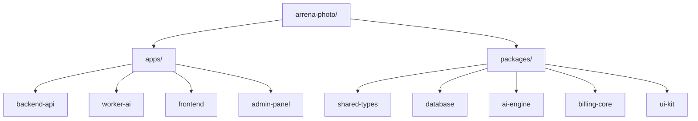
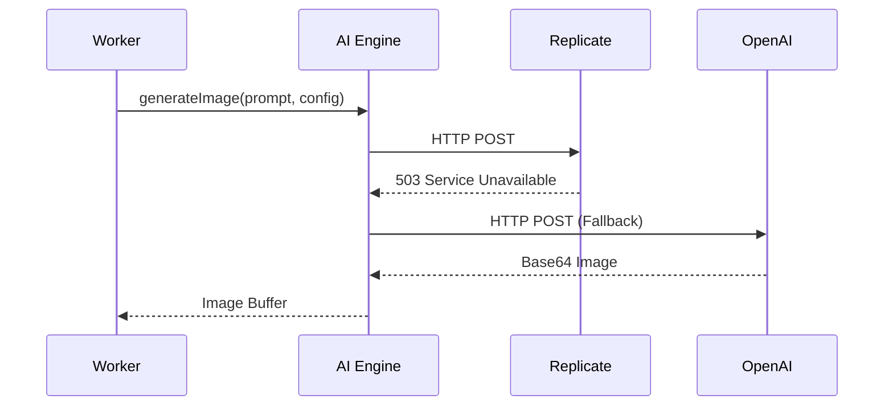

# 🔭 ARCHITECTURE VISION (Целевая Архитектура Arrena Photo)

Этот документ описывает идеальную, масштабируемую архитектуру коммерческого SaaS-продукта Arrena Photo, к которой проект должен прийти после завершения рефакторинга. Данный документ является единым источником истины (SSOT) для инженеров при принятии технических решений (ADR).

> [!CAUTION]  
> Все разрабатываемые фичи и рефакторинги должны приближать нас к описанной ниже архитектуре. Любые компромиссы (Trade-offs), которые противоречат этому видению, должны быть задокументированы в `TECH_DEBT.md`.

---

## 1. Структура директорий (Monorepo)

Текущий монолит должен быть разделен на жестко изолированные пакеты (Packages) и приложения (Apps) в рамках **PNPM Workspace**. Это предотвращает циклические зависимости и позволяет деплоить и масштабировать компоненты независимо.

### Детализация
- `apps/backend-api`: Публичный REST API на NestJS.
- `apps/worker-ai`: Изолированный NestJS микросервис без HTTP сервера для обработки очередей.
- `apps/frontend`: Next.js 14 (App Router) клиентское приложение.
- `packages/shared-types`: Zod схемы и сгенерированные TypeScript интерфейсы. Единственный источник истины для контрактов API.
- `packages/database`: Prisma schema, миграции и сидеры.

---

## 2. Архитектура Backend (API Layer)

Backend API должен стать легким (Lightweight) и отвечать **исключительно** за маршрутизацию, валидацию и бизнес-логику транзакций.

- **Стек:** NestJS, Fastify (вместо Express для x2 throughput), TypeScript 5.
- **Ограничения (Constraints):** Запрещены любые блокирующие Event Loop операции (CPU-bound) или ожидание ответов от LLM провайдеров (I/O-bound delay).
- **Схема работы:**
  1. Клиент делает запрос `POST /generations`.
  2. API валидирует входные данные (через Zod / class-validator).
  3. Проверяет баланс (Idempotency Key).
  4. Создает задачу (Job) в Redis.
  5. Немедленно отвечает `202 Accepted` с `jobId`.

> [!TIP]  
> Target Latency: P95 для всех API запросов не должен превышать **100ms**.

---

## 3. Архитектура Frontend

Frontend должен быть максимально производительным и SEO-оптимизированным для захвата органического трафика из поисковых систем.

- **Стек:** Next.js 14, Tailwind CSS, Radix UI.
- **Server Components (RSC):** Глобальный `'use client'` должен быть удален. Максимальное количество рендеринга выносится на сервер.
- **State Management:** Отказ от глобального монолитного Redux/Zustand хранилища. Локальное состояние компонента хранится в React State, глобальное (сессия, баланс) — в атомарном Zustand.
- **Fetch Strategy:** Использование Server Actions для мутаций данных и `React Query` / `SWR` для поллинга статусов генерации на клиенте.

---

## 4. Архитектура Worker (Фоновая обработка)

Воркер — это сердце (Compute Layer) проекта Arrena Photo. Он полностью изолирован от API.

- **Стек:** NestJS Standalone Application, BullMQ.
- **Горизонтальное масштабирование:** Воркеры должны скейлиться независимо от API. Если очередь задач в Redis превышает 500, Kubernetes KEDA автоматически поднимает новые поды (Pods) Воркера.
- **Graceful Shutdown:** При получении сигнала `SIGTERM` от K8s, Воркер не обрывает генерацию, а ждет завершения активного Job'а (timeout 60s), после чего отключается от базы и умирает.

---

## 5. Shared Packages (Общие пакеты)

Для исключения дублирования кода и расхождения контрактов (API Drift) используется система локальных npm-пакетов (`workspace:*`).

| Пакет | Ответственность |
| :--- | :--- |
| `@arrena/shared-types` | DTO, Enum, Zod schemas. Используется Фронтендом и Бэкендом для 100% Type Safety. |
| `@arrena/database` | `schema.prisma` и сгенерированный Prisma Client. Изолирует DDL операции. |
| `@arrena/ui-kit` | Storybook-компоненты (Кнопки, Инпуты, Модалки). |

---

## 6. Storage (Хранилище данных и медиа)

Данные жестко разделены на реляционные (БД) и объектные (S3).

- **Relational DB (PostgreSQL 16):** Хранит пользователей, платежи, транзакции, метаданные генераций. В базе **строго запрещено хранить Base64**.
- **Connection Pooling:** Доступ к PostgreSQL идет строго через PgBouncer в режиме `transaction` для предотвращения истощения пула соединений.
- **Object Storage (S3 / MinIO):** Физическое хранение всех `image/jpeg` и `image/png`.
- **CDN (Cloudflare):** Картинки отдаются клиентам исключительно через CDN для экономии Egress-трафика и ускорения загрузки (TTFB).

---

## 7. Authentication (Аутентификация и Авторизация)

- **JWT Tokens:** Секреты подписываются алгоритмом HS256. В коде отсутствуют fallbacks (`|| 'secret'`).
- **Sliding Sessions:** Токены имеют короткий срок жизни (15 минут) + долгоживущий Refresh Token в `HttpOnly Secure` куках.
- **OAuth:** Интеграция с Google Auth с проверкой email verification.
- **RBAC:** Доступ к админским панелям закрыт через `@Roles('ADMIN')`. Внедрен жесткий Guard.

---

## 8. Billing (Финансовое ядро)

- **Idempotency (Идемпотентность):** Каждый платеж или списание кредита снабжено уникальным ключом `UUIDv7`. Запрещено повторное списание при случайном двойном клике на UI или retry от Stripe.
- **Compensating Transactions:** Если у пользователя списали кредиты, но OpenAI вернул фатальную ошибку (`400 Bad Request`), Воркер обязан инициировать транзакцию Refund (возврат кредитов).
- **Webhooks:** Обработчики вебхуков Stripe синхронизируют локальные подписки с внешним биллингом, используя строгую верификацию подписей (Signature Verification).

---

## 9. AI Engine (Нейросетевое ядро)

- Пакет `@arrena/ai-engine` отвечает за логику генерации.
- **Cost Routing:** Легкие промпты роутятся на дешевые / быстрые модели (Stable Diffusion XL, SD Turbo). Премиум промпты — на Flux 1.1 Pro или Midjourney.
- **Pipeline:** Нейросетевой пайплайн строится динамически (Node Graph). Шаблоны не захардкожены в коде, а хранятся в JSON конфигах в базе данных.

---

## 10. Provider Abstraction (Абстракция провайдеров)

Система не должна быть "прибита гвоздями" к одному провайдеру (Replicate или OpenAI).

- **Fallbacks:** При падении основного провайдера (503, 429), запрос переключается на альтернативного без уведомления пользователя.
- **Retries:** Реализован Exponential Backoff + Jitter для повторных попыток отправки запроса.

---

## 11. Queue Architecture (Архитектура очередей)

Используется **BullMQ** поверх **Redis Cluster**.

- **Priority:** Премиум-пользователи получают высший приоритет выполнения (Priority: 1). Бесплатные/Промо генерации выполняются по остаточному принципу (Priority: 10).
- **Stalled Jobs:** Повисшие джобы (если под K8s был убит) автоматически подхватываются другими воркерами.
- **Dead Letter Queue (DLQ):** Если задача упала 3 раза подряд, она попадает в DLQ для ручного разбора инженерами через BullBoard (Admin UI).

---

## 12. Logging (Журналирование)

- **Structured Logging:** Используется **Pino**. Все логи в Production выводятся строго в JSON формате.
- **Log Masking:** PII данные (Email, Password Hash, Tokens, Credit Cards) вырезаются на лету до отправки в stdout.
- **Traceability:** В каждый лог инжектируется `TraceId`, позволяющий найти все логи конкретного запроса во всех микросервисах.

---

## 13. Monitoring & Observability (Мониторинг)

- **Metrics:** Сбор метрик через Prometheus (экспортеры NestJS).
- **Dashboards:** В Grafana отслеживаются 4 золотых сигнала (RED/USE):
  1. Утилизация CPU/Memory подов.
  2. Latency API.
  3. Длина очередей BullMQ.
  4. Количество 5xx ошибок.
- **Alerting:** Настроен Opsgenie / Telegram / Slack. Алерты срабатывают, если база падает, или если длина очереди растет быстрее, чем количество воркеров.

---

## 14. Deployment (Развертывание)

- **Infrastructure as Code (IaC):** Все серверы описываются Terraform.
- **CI/CD:** GitHub Actions выполняет `Lint -> Test -> Build -> Docker Push -> Helm Upgrade`.
- **Rolling Updates:** Деплой производится без даунтайма (Zero Downtime). Сначала поднимаются новые поды K8s, проверяется Readiness Probe, затем старые убиваются.
- **Database Migrations:** Prisma миграции применяются автоматически в пайплайне до запуска нового кода. Разрушающие миграции (DROP COLUMN) выполняются в 3 этапа (Expand and Contract pattern).
